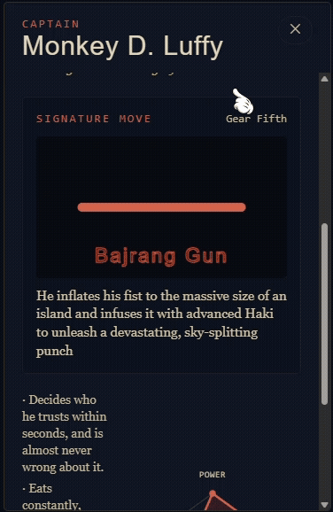

# 🏴‍☠️ One Piece Archive

> An immersive, interactive character archive built with React, TypeScript, Tailwind CSS, and Framer Motion.

**One Piece Archive** is a frontend-focused fan project that transforms character information into an interactive visual experience. Characters are organized by faction and presented through animated wanted-poster cards that reveal detailed dossiers, statistics, and signature-move animations.

The project focuses on **component architecture, type-safe data modeling, animation systems, responsive UI, and accessible motion design** rather than simply presenting static character information.

---

## ✨ Live Demo

🔗 **Live Demo:** `YOUR_LIVE_DEMO_URLhttps://github.com/soumitroghosh363-source/OnePiece`

🔗 **Repository:** `https://one-piece-cyan.vercel.app/`

---

## 📸 Preview


### Character Interaction



> Replace the image paths above with screenshots/GIFs from the actual project.

---

## 🎯 Project Goals

The main goal of this project was to explore how far a frontend experience can be pushed using React and modern animation techniques while keeping the UI maintainable and data-driven.

The project was designed around four principles:

* **Interactive storytelling** instead of static content
* **Reusable React components** instead of duplicated UI
* **Type-safe domain models** using TypeScript
* **Extensible animation architecture** instead of character-specific conditional logic

---

## 🚀 Features

* 🏴‍☠️ Character archive organized by faction
* 🎴 Interactive 3D wanted-poster cards
* 🔄 Click-to-flip character dossiers
* ⚡ Character-specific signature move animations
* 📊 Animated SVG radar charts for character statistics
* 💰 Wanted bounty information
* 👤 Character biography and personality information
* 🍈 Devil Fruit information
* 🎨 Character-specific portrait color palettes
* ✨ Scroll-triggered entrance animations
* 📱 Responsive character grid
* ♿ `prefers-reduced-motion` support
* 🧩 Data-driven character rendering
* 🛠️ TypeScript-based domain modeling
* 🎬 Registry-based animation architecture
* 🎨 Custom visual design system with Tailwind CSS

---

# 🧰 Tech Stack

| Technology         | Purpose                                 |
| ------------------ | --------------------------------------- |
| **React 19**       | UI and component architecture           |
| **TypeScript**     | Static typing and domain modeling       |
| **Tailwind CSS 4** | Styling and responsive layouts          |
| **Framer Motion**  | UI transitions and animations           |
| **Vite**           | Development server and production build |
| **SVG**            | Character statistics visualization      |
| **Oxlint**         | Code linting                            |

---

# 🏗️ Architecture

The application follows a **component-driven and data-driven architecture**.

Character information is separated from presentation logic and represented through TypeScript interfaces.

The UI components consume this structured data and render the appropriate character experience dynamically.

### High-level flow

```text
Character Data
      │
      ▼
TypeScript Domain Models
      │
      ▼
Faction Sections
      │
      ▼
Character Grid
      │
      ▼
Character Poster
      │
      ├── Wanted Poster
      ├── Character Dossier
      ├── Signature Move
      └── Stat Radar
```

This separation allows the content to evolve without requiring the core UI components to be rewritten.

---

# 🗂️ Project Structure

```text
src/
├── components/
│   ├── animations/
│   │   ├── BladeSlash.tsx
│   │   ├── FireBlast.tsx
│   │   ├── HakiBurst.tsx
│   │   ├── IceSpread.tsx
│   │   ├── LightFlash.tsx
│   │   ├── LightningStrike.tsx
│   │   ├── RubberStretch.tsx
│   │   ├── Shockwave.tsx
│   │   ├── SmokeCloud.tsx
│   │   ├── TransformationGlow.tsx
│   │   ├── index.ts
│   │   └── registry.ts
│   │
│   ├── character/
│   │   ├── CharacterGrid.tsx
│   │   ├── CharacterPoster.tsx
│   │   └── PortraitFrame.tsx
│   │
│   ├── common/
│   │   ├── BountyStamp.tsx
│   │   ├── SectionHeading.tsx
│   │   └── StatRadar.tsx
│   │
│   ├── layout/
│   │   ├── CompassMark.tsx
│   │   ├── Footer.tsx
│   │   └── Navbar.tsx
│   │
│   └── sections/
│       ├── FactionSection.tsx
│       └── Hero.tsx
│
├── data/
│   ├── factions.ts
│   ├── navyMembers.ts
│   ├── revolutionaryMembers.ts
│   ├── strawHatPirates.ts
│   └── index.ts
│
├── hooks/
│   ├── useInView.ts
│   └── usePrefersReducedMotion.ts
│
├── types/
│   ├── character.ts
│   └── index.ts
│
├── utils/
│   └── format.ts
│
├── App.tsx
├── index.css
└── main.tsx
```

---

# 🎬 Animation Architecture

One of the main technical challenges in the project was supporting different signature-move animations without coupling character components to individual animation implementations.

Instead of using large conditional blocks such as:

```tsx
if (character.name === '...')
```

the project uses a typed **animation registry**.

Each character references an `AnimationKind`:

```ts
export type AnimationKind =
  | 'haki-burst'
  | 'blade-slash'
  | 'fire-blast'
  | 'ice-spread'
  | 'lightning-strike'
  | 'rubber-stretch'
  | 'smoke-cloud'
  | 'light-flash'
  | 'shockwave'
  | 'transformation-glow';
```

The registry maps each animation type to its corresponding React component:

```ts
export const moveAnimationRegistry: Record<
  AnimationKind,
  ComponentType<MoveAnimationProps>
> = {
  'haki-burst': HakiBurst,
  'blade-slash': BladeSlash,
  'fire-blast': FireBlast,
  'ice-spread': IceSpread,
  'lightning-strike': LightningStrike,
  'rubber-stretch': RubberStretch,
  'smoke-cloud': SmokeCloud,
  'light-flash': LightFlash,
  shockwave: Shockwave,
  'transformation-glow': TransformationGlow,
};
```

The character component can then resolve the animation dynamically:

```ts
const MoveAnimation =
  moveAnimationRegistry[character.signatureMove.animationKind];
```

### Why this approach?

This keeps animation logic:

* isolated
* reusable
* type-safe
* easy to extend
* independent from character-specific UI logic

Adding another animation type can therefore be done without rewriting the core `CharacterPoster` component.

---

# 🎴 Interactive Character Posters

The character poster is the central interaction of the application.

Each character has two visual states:

### Front

The front side displays:

* Wanted status
* Character number
* Character portrait
* Epithet
* Character name
* Bounty
* Faction-specific accent styling

### Back

The dossier reveals:

* Role
* Age
* Height
* Origin
* Devil Fruit
* Biography
* Quote
* Personality notes
* Signature move
* Animated signature move visualization
* Combat statistics

The card uses a 3D `rotateY` transformation to create the flip interaction.

---

# 📊 Character Statistics

Character combat statistics are visualized through a custom SVG radar chart.

Supported statistics include:

* Swordsmanship
* Strength
* Durability
* Intellect
* Speed
* Haki Control

The chart is generated dynamically from the character's available statistics rather than relying on a fixed hardcoded polygon.

Each character can therefore provide a different set of statistics while using the same reusable `StatRadar` component.

---

# 🧩 TypeScript Domain Modeling

The project uses TypeScript to model the application's core domain.

The main entities include:

* `Character`
* `Faction`
* `SignatureMove`
* `CharacterStats`
* `BountyInfo`
* `AnimationKind`

For example:

```ts
export interface Character {
  id: string;
  name: string;
  epithet: string;
  factionId: FactionId;
  role: string;
  age: number | string;
  origin: string;
  height: string;
  bio: string;
  personalityNotes: string[];
  signatureMove: SignatureMove;
  stats: CharacterStats;
}
```

This provides a consistent contract between the data layer and UI components.

---

# 🧠 Key Engineering Challenges

## 1. Supporting Multiple Animations

Each character can have a different signature move.

Instead of embedding animation logic inside character components, an `AnimationKind` is stored in the character data and resolved through the animation registry.

This keeps the UI independent from individual animation implementations.

---

## 2. Building Reusable Character Cards

The same `CharacterPoster` component renders characters from different factions.

Character-specific information is passed through typed props rather than creating separate components for each faction or character.

This reduces duplication and makes the UI easier to maintain.

---

## 3. Creating the Radar Chart

The statistics visualization is generated using SVG geometry.

The component calculates:

* the number of available statistics
* angular positions
* radial distances
* polygon coordinates
* label positions

The final shape is then rendered dynamically based on the character's statistics.

---

## 4. Coordinating Multiple Animation States

The character poster combines several animation layers:

```text
Card entrance
     ↓
3D card flip
     ↓
Dossier reveal
     ↓
Signature move animation
     ↓
Impact text animation
     ↓
Stat radar animation
```

The animations are coordinated through React state and Framer Motion.

---

# ♿ Accessibility & Reduced Motion

Because the project is heavily animation-driven, respecting user motion preferences is important.

The project includes a custom `usePrefersReducedMotion` hook that listens to:

```text
prefers-reduced-motion: reduce
```

The hook also listens for changes to the user's system preference and cleans up the event listener when the component unmounts.

The goal is to ensure that decorative motion can be reduced for users who prefer less animation.

---

# 📱 Responsive Design

The character archive uses a responsive grid:

```text
Mobile
   ↓
1 column

Small screens
   ↓
2 columns

Large screens
   ↓
3 columns

Extra-large screens
   ↓
4 columns
```

The layout adapts the character roster while keeping the core interaction consistent across viewport sizes.

---

# 🎨 Design System

The visual direction is inspired by the aesthetic of classic wanted posters and nautical adventure archives.

The interface combines:

* parchment-like surfaces
* dark ink backgrounds
* gold accents
* faction-specific colors
* monospaced metadata
* display typography
* grain textures
* poster-style framing
* SVG visualizations
* cinematic motion

The goal was to create an interface that feels like an **interactive archive** rather than a conventional character list.

---

# 🧱 Component Philosophy

Components are organized around their responsibility rather than individual pages.

For example:

```text
CharacterPoster
    ├── PortraitFrame
    ├── BountyStamp
    ├── Signature Move
    └── StatRadar
```

This makes each visual system independently reusable and keeps large components from becoming responsible for unrelated UI concerns.

---

# ⚡ Performance Considerations

The project avoids unnecessary animation work by keeping signature-move animations active only when the character dossier is open.

The `active` state is passed into animation components:

```ts
<MoveAnimation
  active={isFlipped}
  accentColor={from}
/>
```

This allows animations to respond to the current interaction state rather than continuously running regardless of whether the user is viewing the character.

The project also separates static character data from UI components, reducing repeated data definitions throughout the interface.

---

# 🛠️ Getting Started

## Prerequisites

Make sure you have installed:

* [Node.js](https://nodejs.org/) 18+
* npm

## Installation

Clone the repository:

```bash
git clone YOUR_GITHUB_REPOSITORY_URL
```

Navigate into the project:

```bash
cd OnePiece
```

Install dependencies:

```bash
npm install
```

Start the development server:

```bash
npm run dev
```

The application will be available through the local Vite development server.

---

# 📦 Available Scripts

| Command           | Description                                                 |
| ----------------- | ----------------------------------------------------------- |
| `npm run dev`     | Starts the Vite development server                          |
| `npm run build`   | Runs TypeScript build checks and creates a production build |
| `npm run lint`    | Runs Oxlint                                                 |
| `npm run preview` | Serves the production build locally                         |

---

# 🔍 Code Quality

The project uses:

* TypeScript
* Oxlint
* Component-level separation
* Typed domain models
* Reusable hooks
* Data-driven rendering
* Centralized animation registration

The production build also runs TypeScript project checks before generating the Vite build output.

---

# 🗺️ Future Improvements

The current project intentionally focuses on the interactive frontend experience.

Possible future improvements include:

* 🔎 Character search
* 🏴‍☠️ Faction filtering
* 🔗 Dedicated character routes
* 📄 Character detail pages
* 📊 More advanced statistics
* 🧪 Automated component testing
* ⚡ Further performance optimization
* 🖼️ Support for additional character artwork
* 💾 Persistent user preferences

These features would extend the archive while preserving the existing component and data architecture.

---

# 📚 What I Learned

Building this project helped me work with several areas of modern frontend development:

* Designing reusable React components
* Modeling complex UI data with TypeScript
* Building registry-based component systems
* Creating interactive 3D UI effects
* Working with Framer Motion
* Generating custom SVG visualizations
* Coordinating multiple animation states
* Building responsive layouts with Tailwind CSS
* Handling reduced-motion preferences
* Separating data from presentation
* Designing frontend architecture around extensibility

---

# 🧪 Project Status

**Status:** Active frontend portfolio project

The current version focuses primarily on the interactive character archive and animation system.

The architecture is intentionally structured so additional characters, factions, statistics, and animation types can be introduced without rewriting the core UI.

---

# ⚠️ Disclaimer

This is an unofficial fan-made project created for **educational and portfolio purposes**.

**One Piece**, its characters, names, artwork, and related intellectual property belong to their respective copyright and trademark holders.

This project is not affiliated with, endorsed by, or sponsored by the official rights holders.

---

# 👨‍💻 Author

**Soumitro Ghosh**

Frontend Developer focused on building interactive, responsive, and maintainable web experiences.

### Tech Interests

* React
* TypeScript
* Tailwind CSS
* JavaScript
* Node.js
* Modern frontend architecture

---

## ⭐ If you found this project interesting

Feel free to explore the repository, check out the live demo, and experiment with the animation and component architecture.

**Built with React, TypeScript, and a little bit of Grand Line energy. 🏴‍☠️**
